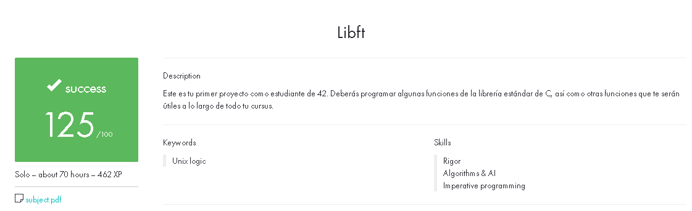

# Libft



## Tu primera librería en C

Libft es un proyecto de la escuela 42 que consiste en crear una librería en C con un conjunto de funciones de propósito general. Estas funciones te serán útiles en tus futuros proyectos en C.

## Tabla de Contenidos
- [Introducción](#introducción)
- [Funciones Implementadas](#funciones-implementadas)
- [Cómo Usar](#cómo-usar)
- [Compilación](#compilación)

## Introducción

Programar en C puede ser complicado sin acceso a las funciones comunes más utilizadas. Este proyecto te permitirá entender cómo funcionan estas funciones, cómo implementarlas y cómo utilizarlas. Crearás una librería propia que será muy útil a lo largo de tu cursus.

## Funciones Implementadas

### Parte 1 - Funciones de libc

- `ft_isalpha`
- `ft_isdigit`
- `ft_isalnum`
- `ft_isascii`
- `ft_isprint`
- `ft_strlen`
- `ft_memset`
- `ft_bzero`
- `ft_memcpy`
- `ft_memmove`
- `ft_strlcpy`
- `ft_strlcat`
- `ft_toupper`
- `ft_tolower`
- `ft_strchr`
- `ft_strrchr`
- `ft_strncmp`
- `ft_memchr`
- `ft_memcmp`
- `ft_strnstr`
- `ft_atoi`
- `ft_calloc`
- `ft_strdup`

### Parte 2 - Funciones adicionales

- `ft_substr`
- `ft_strjoin`
- `ft_strtrim`
- `ft_split`
- `ft_itoa`
- `ft_strmapi`
- `ft_striteri`
- `ft_putchar_fd`
- `ft_putstr_fd`
- `ft_putendl_fd`
- `ft_putnbr_fd`

### Parte Bonus - Funciones de listas

- `ft_lstnew`
- `ft_lstadd_front`
- `ft_lstsize`
- `ft_lstlast`
- `ft_lstadd_back`
- `ft_lstdelone`
- `ft_lstclear`
- `ft_lstiter`
- `ft_lstmap`

## Cómo Usar

1. Clona este repositorio en tu máquina local.
2. Incluye `libft.h` en tu proyecto.
3. Compila la librería usando el comando `make` y enlaza el archivo `libft.a` a tu proyecto.

## Compilación

Para compilar la librería, simplemente ejecuta:

```
make
```
